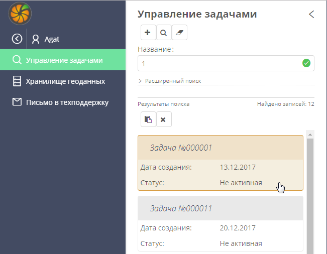
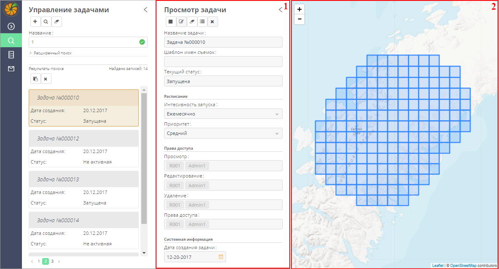

Назначение системы
=========================

Система сбора данных дистанционного зондирования Земли (далее – *система*) предназначена для решения следующих задач:

- Получения данных дистанционного зондирования Земли с внешних ресурсов. Например, таких как «Google Earth».
- Хранения полученных данных и обеспечения поиска требуемых данных в системном хранилище.

Вход в систему
=================

Работа с системой осуществляется с помощью программы-браузера. Для доступа к системе необходимо наличие подключения к сети Интернет.

Для входа в систему требуется открыть браузер и ввести в адресную строку ссылку, предоставленную системным администратором.

Работа в анонимном режиме
----------------------------

До авторизации в системе работа осуществляется в анонимном режиме. В данном режиме пользователь имеет права на просмотр данных, но не имеет прав на создание, редактирование и удаление задач.

Регистрация в системе
----------------------------

Чтобы зарегистрироваться в системе, в главном меню следует нажать на кнопку **Раскрыть** |image1| (рис. 1).
 

		   
Рисунок 1 - Кнопка **Раскрыть**

В режиме полного отображения главного меню следует нажать на кнопку **Аноним** (рис. 2).

Рисунок 2 – Кнопка **Аноним**
		   
Откроется окно авторизации пользователя (рис. 3).
В данном окне следует нажать на кнопку **Зарегистрироваться**.

Рисунок 3 – Окно авторизации пользователя

Откроется окно регистрации пользователя (рис. 4).
В данном окне следует указать адрес личной электронной почты, а также логин и пароль, которые будут использоваться для входа в систему. После этого следует нажать на кнопку **Зарегистрироваться.**

		   
Рисунок 4 – Окно регистрации пользователя

На указанный адрес электронной почты будет отправлено электронное письмо. Для завершения процесса регистрации следует открыть данное письмо и перейти по указанной в нем ссылке.

Авторизация в системе
------------------------

Чтобы авторизоваться в системе, следует открыть окно авторизации пользователя так, как это описано в разделе  `Регистрация в системе`_.
В окне авторизации (рис. 5) следует указать данные личной учетной записи и нажать на кнопку **Войти.**

		   
Рисунок 5 – Окно авторизации в системе

Интерфейс
=============

Работа с системой осуществляется в главном окне (рис. 6).

Главное окно содержит следующие элементы управления:

- Главное меню.
- Панель работы с данными выбранного раздела.
- Карта.

 
Рисунок 6 – Главное окно

С помощью главного меню осуществляется переход между основными разделами системы. По умолчанию главное меню отображается в компактном режиме (рис. 6, цифра 1). Чтобы перейти к режиму полного отображения (рис. 7), следует нажать в главном меню на кнопку **Раскрыть** |image1|.

		   
Рисунок 7 – Главное меню

При выборе в главном меню какого-либо раздела открывается панель управления данными этого раздела (рис. 6, цифра 2). В процессе работы с этой панелью могут отображаться дополнительные панели. Описание панелей управления данными каждого раздела системы представлено в соответствующих разделах данного руководства.

Карта (рис. 6, цифра 3) используется:

- при создании задач – для обозначения полигонов, по которым необходимо получать космосъемку;
- при просмотре результатов выполнения задач – для поиска и просмотра космоснимков.
Изменение масштаба карты выполняется стандартными способами, которые используются при работе с географическими информационными системами. Например:

- Прокруткой колесика мыши: прокручивание от себя увеличивает масштаб, на себя – уменьшает.
- С помощью кнопок, расположенных в левой части карты: нажатие на кнопку |image2| увеличивает масштаб, нажатие на кнопку |image3| уменьшает масштаб

Для перемещения по карте можно использовать клавиши клавиатуры, на которых изображены стрелки, указывающие вверх, вниз, влево и вправо. Кроме того, перемещаться по карте можно, удерживая левую клавишу мыши.

Управление задачами
======================

Раздел системы **Управление задачами** предназначен для:

- Формирования задач, с помощью которых выполняется автоматическое получение требуемой космосъемки с внешнего ресурса.
- Управления данными задачами.
- Просмотра результатов данных задач. Для просмотра результатов можно также использовать `Хранилище геоданных`_.

Чтобы начать работу с задачами, в главном меню следует нажать на кнопку **Управление задачами** (рис. 8).

Рисунок 8 – Кнопка **Управление задачами**

Поиск задач
--------------

Быстрый поиск задач
----------------------

При нажатии в главном меню на кнопку **Управление задачами** (рис. 8) открывается панель быстрого/расширенного поиска (рис. 9).

Рисунок 9 – Панель **Управление задачами**

По умолчанию на данной панели отображается поле **Название**, с помощью которого можно выполнить быстрый поиск одной или нескольких задач. Поле предоставляет возможность полнотекстового поиска, то есть в нем можно указать как часть названия одной или нескольких задач, так и полное название задачи, которую необходимо найти.

После ввода условий поиска на панели инструментов следует дважды нажать на кнопку **Начать поиск** |image4|.
Если в БД содержатся задачи, удовлетворяющие указанным условиям, то список данных задач отобразится в результатах поиска (см. раздел `Просмотр результатов поиска задач`_).

Расширенный поиск задач
--------------------------

Чтобы перейти к инструментам расширенного поиска задач, на панели **Управление задачами** следует нажать на кнопку **Расширенный поиск** (рис. 9).
Расширенный поиск можно выполнять по следующим параметрам (рис. 10):

- **Интенсивность запуска** – поиск по данному полю можно выполнять, если в требуемой задаче указана периодичность ее выполнения: Ежедневно, Ежемесячно или Еженедельно.
- **Приоритет** – поиск по данному полю можно выполнять, если в требуемой задаче указан приоритет выполнения: Высокий, Низкий или Средний.
- **Дата создания** – при щелчке мышью по данному полю открывается календарь. С помощью календаря можно указать временной период (начальную и конечную дату), в течение которого была создана требуемая задача.
 
 .. figure:: _static/poisk_zadach_2.png
           :scale: 100 %
           :align: center
		   
Рисунок 10 – Инструменты расширенного поиска

В качестве условия поиска может также выступать участок территории на карте. В этом случае система выполнит поиск задач, в рамках которых с внешнего сервиса запрашивается космосъемка по указанному участку.

Чтобы перейти в режим отрисовывания требуемого участка, на панели **Управление задачами** следует нажать на кнопку **Ограничить полигоном на карте** (рис. 10). При необходимости выход из данного режима осуществляется при нажатии на кнопку **Esc** на клавиатуре.
В режиме орисовывания участка следует выделить на карте требуемый участок щелчками левой клавиши мыши (рис. 11).

 .. figure:: _static/poisk_zadach_3.png
           :scale: 100 %
           :align: center
		   
Рисунок 11 – Отрисовывание участка

Чтобы завершить отрисовывание, следует повторно нажать на точку участка, которая была установлена первой (рис. 12).

 .. figure:: _static/poisk_zadach_4.png
           :scale: 100 %
           :align: center
		   
Рисунок 12 – Завершение отрисовывания участка

Чтобы выполнить поиск по указанным параметрам, на панели инструментов следует дважды нажать на кнопку **Начать поиск** |image4|.

Если в БД содержатся задачи, удовлетворяющие указанным условиям, то список данных задач отобразится в результатах поиска (см. раздел `Просмотр результатов поиска задач`_).

Просмотр результатов поиска задач
------------------------------------

В результатах поиска (рис. 13) отображается список задач, удовлетворяющих условиям быстрого или расширенного поиска. Если список содержит более пяти задач, то он разбивается на отдельные страницы. Переход между страницами осуществляется с помощью кнопок, расположенных под списком.

Для каждой задачи, представленной в списке, отображается **Название**, **Дата создания** и **Статус**: *Не активная* (задача не запущена) или *Запущена*.

 .. figure:: _static/poisk_zadach_5.png
           :scale: 100 %
           :align: center
		   
Рисунок 13 – Результаты поиска

Управление задачами из результатов поиска
--------------------------------------------

С задачами, представленными в списке результатов поиска, можно выполнять следующие действия:

- Выделять,
- Удалять.

Выделение одной задачи в списке (рис. 14) осуществляется щелчком левой клавиши мыши.

Выделение нескольких задач в списке осуществляется стандартными способами: щелчки мышью + клавиши **Ctrl**, **Shift** на клавиатуре.
Выделение всех задач в списке осуществляется нажатием на кнопку |image5| , расположенную над списком.

Удаление задач, выделенных в списке, осуществляется нажатием на кнопку |image6|, расположенную над списком.

Рисунок 14 – Выделение задачи

Просмотр задачи
------------------

Для перехода в режим просмотра какой-либо задачи следует выделить ее на панели **Управление задачами**, в списке результатов поиска (рис. 14).

Справа отобразится панель **Просмотр задачи** (рис. 15, цифра 1) и карта, на которой обозначен полигон выполнения задачи (рис. 15, цифра 2).

Рисунок 15 – Панель **Просмотр задачи**

Управление задачей в режиме просмотра
---------------------------------------

Управление задачей в режиме просмотра осуществляется с помощью панели инструментов (рис. 16).

Панель инструментов содержит следующие кнопки:

  |image7| **Запуск** – кнопка предназначена для запуска ***неактивной*** задачи. При нажатии на кнопку осуществляется запуск выполнения задачи по указанному расписанию с указанными условиями. Если задача запущена, то кнопка **Запуск** меняет свой внешний вид – |image8| . Если требуется остановить выполнение задачи, следует нажать на кнопку **Запуск** повторно.
  |image9| **Редактировать** – перейти в режим редактирования задачи. Карточка, которая открывается в режиме редактирования задачи, аналогична карточке, которая открывается в режиме создания задачи (см. раздел `Создание задачи`_).
  |image10| **Убрать сетку** – отменить отображение сетки поверх полигона (подробнее см. в разделе `Просмотр результатов выполнения задачи`_).
  |image11| **Просмотр результатов** – просмотреть результаты выполнения задачи (см. раздел `Просмотр результатов выполнения задачи`_).
  |image12| **Удалить** – удалить задачу.
 
 .. figure:: _static/prosmotr_2.png
           :scale: 100 %
           :align: center
 
Рисунок 16 – Панель инструментов

Просмотр результатов выполнения задачи
-----------------------------------------

При нажатии на панели просмотра задачи на кнопку |image11| (рис. 16) на данной панели автоматически формируется список результатов выполнения этой задачи (рис. 17). В каждом результате содержится космосъемка части территории, по которой выполняется задача (подробнее см. в разделе `Создание задачи`_).

 .. figure:: _static/prosmotr_4.png
           :scale: 100 %
           :align: center

Рисунок 17 – Результаты выполнения задачи

Для каждого результата, представленного в списке, отображается название, дата обработки и наименование спутника, с которого была получена космосъемка в рамках выполнения данной задачи.

Управление результатами, представленными в списке, осуществляется с помощью кнопок, которые расположены на панели инструментов в области **Результаты поиска**:

  |image5| **Выделить страницу** – выделить все результаты.
  |image12| **Удалить** – удалить результаты, выделенные в списке.
  |image13| **Скачать** – скачать результаты, выделенные в списке. При выполнении команды в указанную папку на ПК сохраняется ZIP-файл, в котором содержатся космоснимки в формате TIFF.
  |image14| **Просмотреть на отдельном слое** – показать на карте все результаты, выделенные в списке (рис. 18).
  
По умолчанию при просмотре результатов поверх космоснимков на карте отображается сетка. Чтобы скрыть сетку, на панели **Просмотр задачи** следует нажать на кнопку |image10|.
 
  .. figure:: _static/prosmotr_5.png
           :scale: 100 %
           :align: center
		   
Рисунок 18 – Просмотр результатов на отдельном слое

Если требуется просмотреть параметры какого-либо результата, представленного в списке, следует выделить его щелчком левой клавиши мыши.

Откроется карточка результата (рис. 19). Поля карточки являются нередактируемыми и содержат следующую справочную информацию:

- **Название** – название результата выполнения задачи (космосъемки). Формируется по шаблону, указанному в свойствах задачи (см. раздел `Создание задачи`_).
- **Задача** – название задачи, в рамках выполнения которой была получена данная космосъемка.
- **Канал** – диапазон космосъемки.
- **Дата и время запуска запроса** – дата и время, в которое в ходе выполнения задачи был запущен запрос на получение данной космосъемки.
- **Дата и время запуска задачи** – дата и время, в которое была запущена задача.
- **Мета информация** – описание космосъемки.
 
   .. figure:: _static/prosmotr_6.png
           :scale: 100 %
           :align: center
		   
Рисунок 19 – Просмотр съемки

В нижней части карточки (рис. 20) расположены ссылки для скачивания космосъемки в формате TIFF (файлы скачиваются в виде ZIP-архива) и мета-информации космосъемки в формате JSON.
 
   .. figure:: _static/prosmotr_7.png
           :scale: 100 %
           :align: center
		   
Рисунок 20 – Ссылки для скачивания

Создание задачи
------------------

В системе можно создать *долгосрочную задачу*, которая будет выполняться с указанной периодичностью (ежедневно, еженедельно или ежемесячно) до тех пор, пока не будет остановлена вручную, или *разовую* задачу, целью которой является получение космосъемки за определенный период.

Чтобы создать задачу одного из указанных типов, на панели **Управление задачами** (рис. 21) следует нажать на кнопку **Создать** |image2|.

   .. figure:: _static/sozdanie_zadachi_11.png
           :scale: 100 %
           :align: center

Рисунок 21 – Панель **Управление задачами**

Откроется панель **Создание новой задачи** (рис. 22), с помощью которой следует выполнить следующие действия:

- Указать `общие параметры задачи`_.
- `Сформировать запрос к внешнему ресурсу`_.
- `Сформировать геоописание для запроса к внешнему ресурсу`_.

Общие параметры задачи
--------------------------

Чтобы указать общие параметры задачи, на панели **Создание задачи** (рис. 22) следует заполнить поля:

- **Название задачи** – название указывается в свободной форме.
- **Шаблон имен съемок** – по шаблону, указанному в данном поле, формируются названия для результатов выполнения задачи (космосъемок).

По умолчанию в поле указан шаблон **<%= satellite %> (<%= date %>)**, где:
- **satellite** – название спутника, с которого поступает космосъемка, или название требуемого сенсора данного спутника. Например, **LANDSAT/LC8_L1T_TOA**.
- **date** – дата получения космосъемки.

Данный шаблон является редактируемым.

   .. figure:: _static/sozdanie_zadachi_1.png
           :scale: 100 %
           :align: center
 
Рисунок 22 – Панель **Создание задачи**

Если задача является долгосрочной, то в группе полей **Расписание** следует указать:

- **Интенсивность запуска** – периодичность, с которой будет запускаться задача: *Ежедневно*, *Ежемесячно* или *Еженедельно*. Например, для задачи, в рамках которой осуществляется получение космоснимков со спутников **LANDSAT 7** и **LANDSAT 8** целесообразно установить еженедельное расписание, так как данные спутники пролетают над одним и тем же участком Земли с периодичностью один раз в неделю. Если для такой задачи будет установлено ежедневное расписание, то в течение недели в `хранилище геоданных`_ будут поступать одни и те же космоснимки.
- **Приоритет**, который имеет данная задача: *Высокий*, *Низкий*, *Средний*. Приоритет определяет очередность выполнения задачи в общей очереди задач.

Если задача является *разовой*, то поля группы **Расписание** следует оставить пустыми.

С помощью группы полей **Права доступа** следует указать пользователей, которые имеют права на **Просмотр**, **Редактирование**, **Удаление** задачи или на все перечисленные действия. Последняя группа пользователей указывается в поле **Права доступа**.
По умолчанию во всех полях группы **Права доступа** указывается пользователь, который создал текущую задачу. Чтобы добавить в какое-либо поле других пользователей системы, следует щелкнуть левой клавишей мыши по данному полю и выбрать требуемых пользователей из выпадающего списка.

Кнопки **Запрос** и **Геометрия** предназначены для формирования запроса к внешнему ресурсу и формирования геоописания для запроса к внешнему ресурсу (см. разделы `Формирование запроса к внешнему ресурсу и Формирование геоописания для запроса к внешнему ресурсу`_).
Поля группы Системная информация являются нередактируемыми и заполняются автоматически после сохранения задачи.

Формирование запроса к внешнему ресурсу
------------------------------------------

После формирования общих параметров задачи необходимо сформировать запрос к внешнему ресурсу, который будет выполняться в рамках данной задачи.

Чтобы перейти к панели формирования запроса, на панели **Создание новой задачи** следует нажать на кнопку **Запрос** (рис. 22).
Откроется панель **Редактирование запроса** (рис. 23).

Если задача является *долгосрочной*, то запрос для данной задачи рекомендуется написать в поле **Запрос** вручную. Пример запроса постоянной задачи представлен на рисунке 23.

Если задача является *разовой*, то запрос для данной задачи можно сформировать с помощью конструктора.
Чтобы открыть конструктор, на панели **Редактирование запроса** следует нажать на кнопку |image16|.

   .. figure:: _static/sozdanie_zadachi_8.png
           :scale: 100 %
           :align: center
		   
Рисунок 23 – Панель **Редактирование запроса**

В окне конструктора (рис. 24) следует заполнить следующие поля:

- **Ресурс** – из выпадающего списка необходимо выбрать внешний ресурс, которому следует адресовать запрос.
- **Сенсор** – в данном поле следует указать название требуемого сенсора требуемого спутника. Например, **LANDSAT/LC8_L1T_TOA**.
- **Канал** – в данном поле следует указать идентификатор канала. Например, **B2** (Band 2, Blue). 
- **Даты** – при нажатии на данное поле открывается календарь. С помощью календаря следует указать дату начала и дату окончания временного периода, за который требуется получить космосъемку.

Для формирования запроса на основе указанных данных следует нажать на кнопку **Сформировать**.

   .. figure:: _static/sozdanie_zadachi_9.png
           :scale: 100 %
           :align: center

Рисунок 24 – Конструктор запроса

При необходимости в ходе формирования запроса можно быстро удалять данные (рис. 25):

- При нажатии на кнопку **Очистить поля** удаляются данные из полей конструктора.
- При нажатии на кнопку **Очистить запрос** |image10|, которая расположена на панели инструментов, удаляется текст запроса из поля **Запрос**. Данная команда действует как для запроса, который написан вручную, так и для запроса, сформированного с помощью конструктора.

   .. figure:: _static/sozdanie_zadachi_10.png
           :scale: 100 %
           :align: center 

Рисунок 25 – Кнопки для быстрой очистки данных

Чтобы сохранить запрос, на панели инструментов следует нажать на кнопку **Сохранить** |image17|.

Формирование геоописания для запроса к внешнему ресурсу
----------------------------------------------------------

После формирования запроса необходимо указать на карте территорию, для которой будет выполняться данный запрос. Для этого на панели **Создание новой задачи** (рис. 26) следует нажать на кнопку **Геометрия**.

Откроется панель **Редактирование геометрии запроса**.

   .. figure:: _static/sozdanie_zadachi_4.png
           :scale: 100 %
           :align: center 

Рисунок 26 – Панель **Редактирование геометрии запроса**

С помощью данной панели следует сформировать геоописание требуемой территории одним из следующих способов:

- Указать геоописание вручную в поле **Геоописание** (пример представлен на рисунке 26). В описании следует указать форму участка, для которого будет выполняться запрос, и координаты данного участка.
- Загрузить геоописание из файла JSON. Для этого на панели инструментов следует нажать на кнопку **Загрузить** |image13| и выбрать требуемый файл с помощью Проводника Windows.
- Нарисовать участок на карте. Для этого на панели инструментов следует нажать на кнопку **Нарисовать на карте** |image14|. Над панелью **Редактирование геометрии запроса** откроется карта (рис. 27).

Чтобы обозначить участок, для которого будет выполняться запрос, следует выделить его на карте щелчками левой клавиши мыши (рис. 27).

   .. figure:: _static/sozdanie_zadachi_2.png
           :scale: 100 %
           :align: center  

Рисунок 27 – Отрисовывание участка

Чтобы замкнуть точки полигона участка, следует повторно нажать на точку, которая была установлена первой (рис. 28).

   .. figure:: _static/sozdanie_zadachi_3.png
           :scale: 100 %
           :align: center  

Рисунок 28 – Завершение отрисовывания участка

Когда точки полигона замкнутся, карта автоматически закроется и на панели **Редактирование геометрии запроса** отобразится геоописание выделенного участка.

Участок, геоописание которого сформировано одним из способов, описанных выше, необходимо нарезать на равнозначные секторы. В ходе выполнения задачи ко внешнему ресурсу будут последовательно отправляться запросы по каждому сектору в отдельности.

Чтобы выполнить нарезку участка, на панели инструментов следует нажать на кнопку **Нарезать** |image18| (рис. 29). В отобразившемся поле **Сторона квадрата, км** следует указать размер стороны сектора. Значение можно указать в поле вручную или с помощью счетчика. Кнопки управления счетчиком отображаются при наведении курсора мыши на правую границу поля. Минимальным значением стороны квадрата является 0.05 км.

После указания значения стороны квадрата следует нажать на кнопку **Мультипликация**.

   .. figure:: _static/sozdanie_zadachi_5.png
           :scale: 100 %
           :align: center  

Рисунок 29 – Нарезка геометрии

В поле **Нарезка геометрии задачи** (рис. 30) отобразится описание автоматически созданных секторов.

   .. figure:: _static/sozdanie_zadachi_6.png
           :scale: 100 %
           :align: center  

Рисунок 30 – Поле **Нарезка геометрии задачи**

При необходимости поля панели **Редактирование геометрии запроса** можно очистить нажатием на кнопку **Очистить** |image10|, которая расположена на панели инструментов. После этого поля следует заполнить повторно.

Чтобы сохранить описание геометрии задачи, на панели инструментов следует нажать на кнопку **Сохранить геометрию** |image17|.
Панель **Редактирование геометрии запроса** закроется.

Чтобы просмотреть геометрию задачи на карте, на панели **Создание задачи** следует нажать на кнопку **Показать геометрию** |image14| (рис. 31). На карте отобразится созданный полигон, нарезанный на секторы.

Чтобы сохранить задачу, на панели **Создание задачи** следует нажать на кнопку **Сохранить** |image17|  .

   .. figure:: _static/sozdanie_zadachi_7.png
           :scale: 100 %
           :align: center   

Рисунок 31 – Просмотр геометрии задачи на карте

Хранилище геоданных
=======================

В хранилище геоданных содержатся результаты выполнения задач, которые когда-либо были запущены в системе (см. раздел `Управление задачами`_). В каждом результате каждой задачи содержится космосъемка части территории, по которой выполняется данная задача (подробнее см. в разделе `Создание задачи`_). Результаты выполнения задач можно просматривать на карте в онлайн-режиме или скачивать в формате TIFF.

Чтобы перейти в режим работы с хранилищем, в главном меню следует нажать на кнопку **Хранилище геоданных** (рис. 32).

   .. figure:: _static/hranilische_1 .png
           :scale: 100 %
           :align: center 

Рисунок 32 – Кнопка **Управление задачами**

Поиск космосъемок
---------------------

Быстрый поиск космосъемок
-----------------------------

При нажатии в главном меню на кнопку **Хранилище геоданных** открывается панель **Управление хранилищем** (рис. 32), которая предназначена для быстрого/расширенного поиска результатов выполнения задач (космосъемок).

Для быстрого поиска на данной панели расположены следующие поля:

- **Номер** – номер результата выполнения задачи. Номер содержится в названии результата, а также в названиях файлов для скачивания данного результата (см. раздел `Просмотр космосъемки`_). Данное поле является необязательным для заполнения.
- **Задача** – название задачи, в рамках выполнения которой был получен требуемый результат. При щелчке мышью по данному полю открывается выпадающий список, который содержит полный перечень задач, созданных в системе. Название задачи можно выбрать из выпадающего списка, или, если данный список слишком велик, указать в поле **Задача** вручную. Поле **Задача является** обязательным для заполнения.
- **Дата запуска задачи** – в данном поле автоматически формируется выпадающий список дат запуска задачи, выбранной в поле **Задача** (см. выше). Поле является обязательным для заполнения.

Чтобы выполнить быстрый поиск по указанным параметрам, на панели инструментов следует нажать на кнопку **Искать данные** |image4|.
Если в хранилище геоданных содержатся космосъемки, удовлетворяющие указанным параметрам, то они отобразятся в результатах поиска (см. раздел `Управление космосъемками`_).

Расширенный поиск космосъемок
--------------------------------

Чтобы перейти к инструментам расширенного поиска космосъемки, на панели **Управление задачами** следует нажать на кнопку |image19|  **Расширенный поиск** (рис. 32).

Расширенный поиск можно выполнять по следующим параметрам (рис. 33):

- **Ресурс** – название внешнего ресурса, с которого была получена требуемая космосъемка. Выбор ресурса осуществляется из выпадающего списка фиксированных значений.
- **Сенсор** – сенсор спутника, указанный в запросе задачи, по которой была получена требуемая космосъемка.
- **Канал** – диапазон съемки, указанный в запросе задачи, по которой была получена требуемая космосъемка.

   .. figure:: _static/hranilische_4 .png
           :scale: 100 %
           :align: center  

Рисунок 33 – Инструменты расширенного поиска

Область поиска космосъемки можно также ограничить участком на карте. Чтобы перейти в режим отрисовывания требуемого участка, на панели **Управление хранилищем** следует нажать на кнопку **Ограничить полигоном на карте** (рис. 33). При необходимости выход из данного режима осуществляется при нажатии на кнопку **Esc** на клавиатуре.

В режиме орисовывания участка следует выделить на карте требуемый участок щелчками левой клавиши мыши (рис. 34).
 
 .. figure:: _static/poisk_zadach_3 .png
           :scale: 100 %
           :align: center  

Рисунок 34 – Отрисовывание участка

Чтобы завершить отрисовывание, следует повторно нажать на точку участка, которая была установлена первой (рис. 35).

   .. figure:: _static/poisk_zadach_4 .png
           :scale: 100 %
           :align: center  

Рисунок 35 – Завершение отрисовывания участка

Чтобы выполнить поиск по указанным параметрам, на панели инструментов следует нажать на кнопку **Искать данные** |image4|  .
Если в хранилище геоданных содержатся космосъемки, удовлетворяющие указанным параметрам, то они отобразятся в результатах поиска (см. раздел `Управление космосъемками`_).

Управление космосъемками
-------------------------------
Космосъемки, удовлетворяющие условиям быстрого или расширенного поиска, отображаются в области **Результаты поиска** (рис. 36). Для каждой космосъемки, представленной в списке, отображается название, дата обработки и наименование спутника, с которого она была получена.

   .. figure:: _static/hranilische_5 .png
           :scale: 100 %
           :align: center  

Рисунок 36 – Список результатов поиска

Управление космосъемками, представленными в списке, осуществляется с помощью кнопок, которые расположены на панели инструментов в области **Результаты поиска**:

|image5| **Выделить все** – выделить все космосъемки.
|image6| **Удалить** – удалить космосъемки, выделенные в списке.
|image13| **Скачать** – скачать космосъемки, выделенные в списке. При выполнении команды в указанную папку на ПК сохраняется ZIP-файл, в котором содержатся файлы TIFF/TFW.
|image14| **Просмотреть на отдельном слое** – показать на карте все космосъемки, выделенные в списке.
|image11| **Просмотреть лог** – открыть log-файл взаимодействия с внешним сервисом. Данный файл может быть запрошен службой технической поддержки системы в случае возникновения проблем или вопросов при работе с хранилищем геоданных.

Просмотр космосъемки
------------------------

При выделении в результатах поиска какой-либо космосъемки справа открывается карточка этой космосъемки (рис. 37, цифра 1) и карта, на которой отображаются данные этой космосъемки (рис. 37, цифра 2).

   .. figure:: _static/hranilische_6 .png
           :scale: 100 %
           :align: center

Рисунок 37 – Данные космосъемки

Поля карточки космосъемки являются нередактируемыми и содержат следующую справочную информацию:

- **Название** – название результата выполнения задачи (космосъемки). Формируется по шаблону, указанному в свойствах задачи (см. раздел `Создание задачи`_).
- **Задача** – название задачи, в рамках выполнения которой была получена данная космосъемка.
- **Канал** – диапазон космосъемки.
- **Дата и время запуска запроса** – дата и время, в которое в ходе выполнения задачи был запущен запрос на получение данной космосъемки.
- **Дата и время запуска задачи** – дата и время, в которое была запущена задача.
- **Мета информация** – описание космосъемки.

В нижней части карточки расположены ссылки для скачивания космосъемки в формате TIFF (файлы скачиваются в виде ZIP-архива) и мета-информации космосъемки в формате JSON.

   .. figure:: _static/prosmotr_3 .png
           :scale: 100 %
           :align: center
 
Рисунок  – Ссылки для скачивания

Письмо в техподдержку
======================

Если при работе с системой появилась проблема или возник вопрос, рекомендуется написать письмо в техническую поддержку компании-разработчика системы. Если проблема/вопрос возникли при работе с **Хранилищем геоданных**, то в письмо рекомендуется скопировать содержимое log-файла (см. раздел `Управление космосъемками`_).

Чтобы перейти к форме, которая предназначена для отправки письма, в главном меню следует нажать на кнопку **Письмо в техподдержку** (рис. 39).

В открывшейся форме, в поле **Тема** следует указать тему письма, а в поле **Описание** – суть проблемы или вопроса.
Если в процессе составления письма требуется быстро удалить текст в полях **Тема** и **Описание**, следует нажать на кнопку **Очистить поля**.

Для отправки письма следует нажать на кнопку **Отправить**. Письмо будет оправлено на адрес электронной почты отдела техподдержки.

   .. figure:: _static/pismo_1.png
           :scale: 100 %
           :align: center
		   
Рисунок 39 – Форма отправки письма в техподдержку

.. |image1| image:: https://github.com/citoruspm/agat/blob/master/source/_static/knopka_1.png?raw=true
.. |image2| image:: https://github.com/citoruspm/agat/blob/master/source/_static/knopka_20.png?raw=true
.. |image3| image:: https://github.com/citoruspm/agat/blob/master/source/_static/knopka_21.png?raw=true
.. |image4| image:: https://github.com/citoruspm/agat/blob/master/source/_static/knopka_4.png?raw=true
.. |image5| image:: https://github.com/citoruspm/agat/blob/master/source/_static/knopka_7.png?raw=true
.. |image6| image:: https://github.com/citoruspm/agat/blob/master/source/_static/knopka_8.png?raw=true
.. |image7| image:: https://github.com/citoruspm/agat/blob/master/source/_static/knopka_9.png?raw=true
.. |image8| image:: https://github.com/citoruspm/agat/blob/master/source/_static/knopka_14.png?raw=true
.. |image9| image:: https://github.com/citoruspm/agat/blob/master/source/_static/knopka_10.png?raw=true
.. |image10| image:: https://github.com/citoruspm/agat/blob/master/source/_static/knopka_5.png?raw=true
.. |image11| image:: https://github.com/citoruspm/agat/blob/master/source/_static/knopka_12.png?raw=true
.. |image12| image:: https://github.com/citoruspm/agat/blob/master/source/_static/knopka_13.png?raw=true
.. |image13| image:: https://github.com/citoruspm/agat/blob/master/source/_static/knopka_15.png?raw=true
.. |image14| image:: https://github.com/citoruspm/agat/blob/master/source/_static/knopka_16.png?raw=true
.. |image15| image:: https://github.com/citoruspm/agat/blob/master/source/_static/knopka_11.png?raw=true
.. |image16| image:: https://github.com/citoruspm/agat/blob/master/source/_static/knopka_22.png?raw=true
.. |image17| image:: https://github.com/citoruspm/agat/blob/master/source/_static/knopka_19.png?raw=true
.. |image18| image:: https://github.com/citoruspm/agat/blob/master/source/_static/knopka_18.png?raw=true
.. |image19| image:: https://github.com/citoruspm/agat/blob/master/source/_static/knopka_6.png?raw=true
